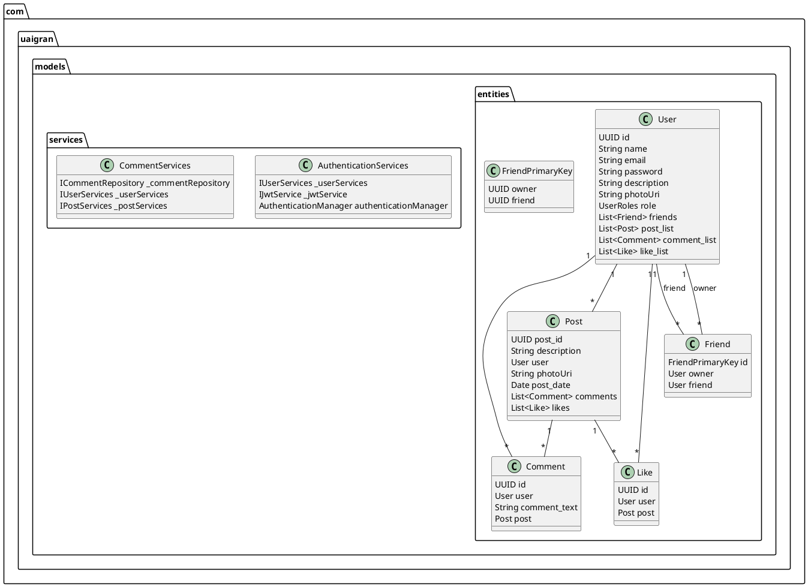
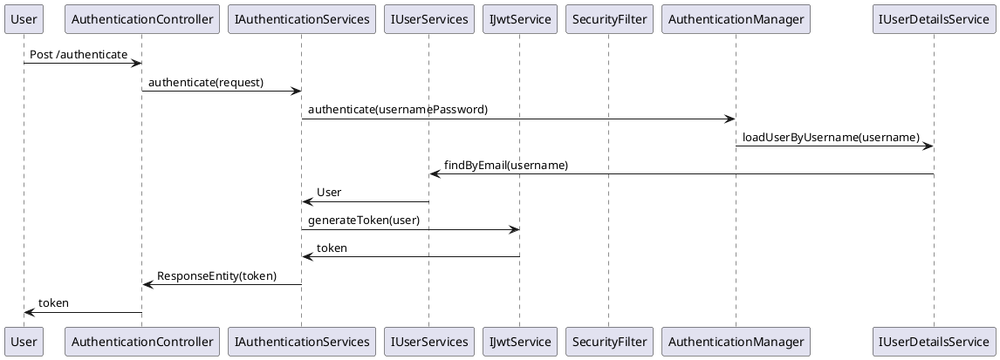
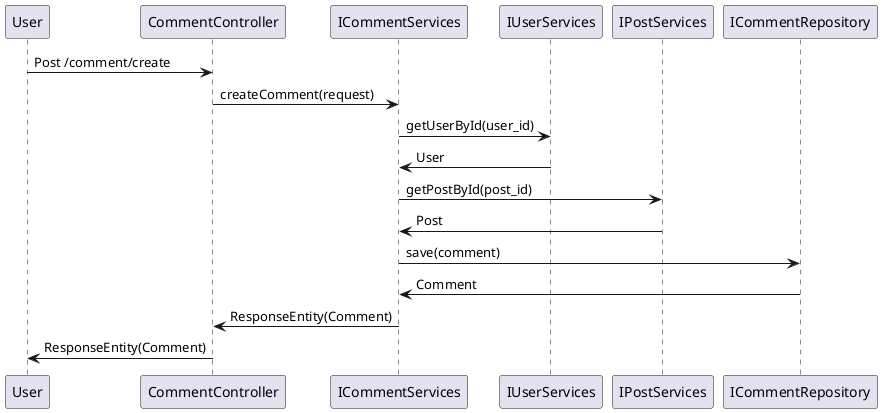

# Documento de Especificação do Software: Uaigran Social Network API

## Resumo do Funcionamento do Software

O "Uaigran Social Network API" é uma aplicação de backend desenvolvida utilizando o framework Spring Boot. A finalidade da aplicação é gerenciar operações comuns de uma rede social, tais como autenticação de usuários, operações de CRUD (Create, Read, Update, Delete) em postagens, comentários e curtidas, além das funcionalidades de gestão de amigos. Para facilitar a documentação e integração com a API, foi implementada com suporte ao Swagger.

## Estrutura do Projeto

A estrutura do projeto segue os princípios do Spring Boot com a separação de diferentes camadas de responsabilidade, incluindo controladores (controllers), serviços, repositórios e modelos de entidades.

### Estrutura de Pacotes

- **config**: Contém classes de configuração do aplicativo, tais como AWS e segurança.
- **controllers**: Contém os controladores responsáveis pelas rotas da aplicação.
- **docs**: Contém as definições de Swagger e as classes de erros.
- **exceptions**: Contém as classes de exceções customizadas da aplicação.
- **models.entities**: Contém as entidades mapeadas para o banco de dados.
- **models.repository**: Contém interfaces de repositórios para acesso à camada de persistência.
- **models.services**: Contém a implementação dos serviços de negócios da aplicação.
- **models.services.security**: Contém serviços relacionados à segurança, como geração de JWT.

## Descrição Técnica do Código

### Configurações

#### UaigranApplication.java

Classe principal da aplicação, responsável pela inicialização do Spring Boot.

```java
@SpringBootApplication
@EnableJpaRepositories("com.uaigran.models.repository")
@EntityScan("com.uaigran.models.entities")
@ComponentScan(basePackages = { "com.uaigran" })
public class UaigranApplication {
    public static void main(String[] args) {
        SpringApplication.run(UaigranApplication.class, args);
    }
}
```

#### AwsConfig.java

Configuração para integração com o AWS S3, utilizando LocalStack para teste local.

```java
@Configuration
public class AwsConfig {
    @Bean
    public AmazonS3 amazonS3() {
        return AmazonS3ClientBuilder
                .standard()
                .withCredentials(new AWSStaticCredentialsProvider(new BasicAWSCredentials("uaigran", "uaigran")))
                .withEndpointConfiguration(new AwsClientBuilder.EndpointConfiguration("http://s3.localhost.localstack.cloud:4566", Regions.US_WEST_2.getName()))
                .build();
    }
}
```
#### SecurityConfigurations.java

Configuração de segurança utilizando Spring Security para autenticação e autorização.

```java
@Configuration
@EnableWebSecurity
public class SecurityConfigurations {
    @Autowired
    SecurityFilter securityFilter;

    private static final String[] AUTH_WHITELIST = {
            "/v3/api-docs/**",
            "/api/swagger-ui/**",
            "/api/swagger-ui.html"
    };

    @Bean
    public SecurityFilterChain securityFilterChain(HttpSecurity httpSecurity) throws Exception {
        return httpSecurity
                .cors(AbstractHttpConfigurer::disable)
                .csrf(AbstractHttpConfigurer::disable)
                .sessionManagement(session -> session.sessionCreationPolicy(SessionCreationPolicy.STATELESS))
                .authorizeHttpRequests(authorize -> authorize
                                .requestMatchers("/user/create").permitAll()
                                .requestMatchers("/authenticate").permitAll()
                                .requestMatchers(AUTH_WHITELIST).permitAll()
                                .requestMatchers(HttpMethod.OPTIONS,"/**").permitAll()
                                .anyRequest().authenticated()
                        )
                .addFilterBefore(securityFilter, UsernamePasswordAuthenticationFilter.class)
                .build();
    }

    @Bean
    public AuthenticationManager authenticationManager(AuthenticationConfiguration authenticationConfiguration) throws Exception {
        return authenticationConfiguration.getAuthenticationManager();
    }

    @Bean
    public PasswordEncoder passwordEncoder() {
        return new BCryptPasswordEncoder();
    }

    @Bean
    CorsConfigurationSource corsConfigurationSource() {
        CorsConfiguration configuration = new CorsConfiguration();
        configuration.setAllowedOrigins(Arrays.asList("*"));
        configuration.setAllowedMethods(Arrays.asList("*"));
        configuration.setAllowedHeaders(Arrays.asList("*"));
        UrlBasedCorsConfigurationSource source = new UrlBasedCorsConfigurationSource();
        source.registerCorsConfiguration("/**", configuration);
        return source;
    }
}
```

#### SwaggerConfiguration.java

Configuração do Swagger para documentação automatizada da API.

```java
@Configuration
public class SwaggerConfiguration {
    @Bean
    public OpenAPI myOpenAPI() {
        Server devServer = new Server();
        devServer.setUrl("http://localhost:8082");
        devServer.setDescription("Server URL in Development environment");

        License mitLicense = new License().name("MIT License").url("https://choosealicense.com/licenses/mit/");

        Info info = new Info()
                .title("Uaigran API")
                .version("1.0")
                .description("Essa API tem o objetivo de realizar algumas das operações que ocorrem em uma rede social!")
                .license(mitLicense);

        return new OpenAPI().info(info).servers(List.of(devServer));
    }
}
```

### Controladores

#### AuthenticationController.java

Controlador responsável pela autenticação de usuários.

```java
@RestController
@RequestMapping("/authenticate")
@CrossOrigin(origins = "*", allowedHeaders = "*")
public class AuthenticationController implements AuthenticationControllerDocs {
    @Autowired
    private IAuthenticationServices _authenticateServices;

    @PostMapping()
    @Override
    public ResponseEntity<Object> authenticate(@RequestBody AuthenticationRequest request) throws UnauthorizedException {
        return _authenticateServices.authenticate(request);
    }
}
```

#### Exemplos de outros controladores

- **CommentController.java**: Controla operações relacionadas a comentários.
- **FriendController.java**: Controla operações relacionadas a amizades.
- **LikeController.java**: Controla operações relacionadas a curtidas.
- **PostController.java**: Controla operações relacionadas a postagens.
- **UserController.java**: Controla operações relacionadas a usuários.

### Serviços

#### AuthenticationServices.java

Serviço que contém a lógica de autenticação.

```java
@Service
public class AuthenticationServices implements IAuthenticationServices {
    @Autowired
    private IUserServices _userServices;
    @Autowired
    private IJwtService _jwtService;

    @Autowired
    AuthenticationManager authenticationManager;

    public ResponseEntity<Object> authenticate(AuthenticationRequest request) throws UnauthorizedException {
        try {
            var usernamePassword = new UsernamePasswordAuthenticationToken(request.email,request.password);
            var auth = authenticationManager.authenticate(usernamePassword);
            var token = _jwtService.generateToken((User) auth.getPrincipal());
            var response = new AuthenticationResponse();

            response.setToken(token);
            response.setUser_id(((User) auth.getPrincipal()).getId());

            return ResponseEntity.ok().body(response);
        } catch (Exception e){
            throw  new UnauthorizedException("Invalid user credentials!");
        }
    }
}
```

#### Outro exemplo relevante

- **CommentServices.java**: Serviço que lida com a lógica de negócios de comentários.
- **FriendServices.java**: Serviço que lida com a lógica de negócios de amizades.
- **PostServices.java**: Serviço que lida com a lógica de negócios de postagens.
- **UserServices.java**: Serviço que lida com a lógica de negócios de usuários.

### Repositórios

#### IUserRepository.java

Interface do repositório de usuário que extende JpaRepository para operações CRUD.

```java
@Repository
public interface IUserRepository extends JpaRepository<User,UUID> {
    UserDetails findByEmail(String email);
    @Override
    Optional<User> findById(UUID uuid);
}
```

### Entidades

#### User.java

Modelo de usuário que implementa UserDetails para integração com Spring Security.

```java
@Builder
@Getter
@Setter
@AllArgsConstructor
@NoArgsConstructor
@Entity
@Table(name = "users")
public class User implements UserDetails {
    @Id
    @Column(name = "id")
    private UUID id;
    @Column(name = "name",nullable = false)
    private String name;
    @Column(name = "email",unique = true,nullable = false)
    private String email;
    @Column(name = "password",nullable = false)
    private String password;
    @Column(name = "description")
    private String description;
    @Column(name = "photoUri")
    private String photoUri;
    @Column(name = "role",columnDefinition ="VARCHAR(100)")
    private UserRoles role;

    @OneToMany(mappedBy="owner", cascade=CascadeType.ALL, orphanRemoval = true,fetch = FetchType.LAZY)
    private List<Friend> friends;

    @OneToMany(mappedBy = "user",cascade = CascadeType.ALL, orphanRemoval = true,fetch = FetchType.LAZY)
    private List<Post> post_list;

    @OneToMany(mappedBy = "user",cascade = CascadeType.ALL, orphanRemoval = true,fetch = FetchType.LAZY)
    private List<Comment> comment_list;

    @OneToMany(mappedBy = "user",cascade = CascadeType.ALL, orphanRemoval = true,fetch = FetchType.LAZY)
    private List<Like> like_list;

    // Implementação dos métodos de UserDetails...
}
```

## Diagramas

### Diagrama de Classes Simplificado



### Diagrama de Sequência: Fluxo de Autenticação



### Diagrama de Sequência: Criação de Comentário



## Conclusão

O projeto "Uaigran Social Network API" é uma aplicação completa e bem estruturada que cobre diversas funcionalidades comuns em redes sociais. Com o uso do Spring Boot e a organização de pacotes claros, a aplicação é escalável e fácil de manter. A configuração de segurança com JWT e a documentação da API com Swagger garantem uma integração segura e eficiente com outras aplicações.

Note que este documento é uma visão geral simplificada do que o código poderia ser. Para mais detalhes, cada classe e método deve ser estudado em profundidade, e os diagramas mais detalhados podem ser gerados usando ferramentas apropriadas e inspecionando o código detalhadamente.

