**Especificação Funcional: Projeto UaiGran**

O projeto UaiGran consiste em uma aplicação de rede social construída utilizando o framework Spring Boot em Java. A seguir estão descritas as funcionalidades das principais classes e seus métodos, bem como os diagramas que representam a arquitetura do sistema.

### 1. Configurações Gerais da Aplicação

#### 1.1. `UaigranApplication`: Classe Principal da Aplicação
- **Rotas:** Nenhuma rota específica.
- **Descrição:** Classe principal para inicializar a aplicação Spring Boot.
- **Métodos:**
  - `public static void main(String[] args)`: Método de entrada da aplicação.

#### 1.2. `AwsConfig`: Configuração de AWS
- **Rotas:** Nenhuma rota específica.
- **Descrição:** Classe de configuração que define o cliente Amazon S3.
- **Métodos:**
  - `public AmazonS3 amazonS3()`: Método que retorna a instância do cliente Amazon S3.

#### 1.3. `SecurityConfigurations`: Configuração de Segurança
- **Rotas:** Nenhuma rota específica.
- **Descrição:** Classe de configuração de segurança que define filtros e políticas de autenticação.
- **Métodos:**
  - `public SecurityFilterChain securityFilterChain(HttpSecurity httpSecurity)`: Configura a cadeia de filtros de segurança.
  - `public AuthenticationManager authenticationManager(AuthenticationConfiguration authenticationConfiguration)`: Configura o gerenciador de autenticação.
  - `public PasswordEncoder passwordEncoder()`: Configura o encoder de senha.
  - `CorsConfigurationSource corsConfigurationSource()`: Configuração do CORS.

#### 1.4. `SwaggerConfiguration`: Configuração do Swagger
- **Rotas:** Nenhuma rota específica.
- **Descrição:** Classe de configuração do Swagger que define a documentação da API.
- **Métodos:**
  - `public OpenAPI myOpenAPI()`: Método que retorna a configuração do OpenAPI.

### 2. Controllers (Controladores)

#### 2.1. `AuthenticationController`: Controlador de Autenticação
- **Rotas:**
  - `POST /authenticate`
- **Descrição:** Autentica um usuário e gera um token.
- **Métodos:**
  - `public ResponseEntity<Object> authenticate(@RequestBody AuthenticationRequest request)`: Autenticação de usuário.

#### 2.2. `CommentController`: Controlador de Comentários
- **Rotas:**
  - `POST /comment/create`
  - `POST /comment/update`
  - `GET /comment/list/{post_id}`
  - `DELETE /comment/delete/{comment_id}`
- **Descrição:** Gerencia operações sobre os comentários dos posts.
- **Métodos:**
  - `public ResponseEntity<Object> createComment(@ModelAttribute CreateCommentRequest request)`: Cria um novo comentário.
  - `public ResponseEntity<Object> updateComment(@RequestBody UpdateCommentRequest request)`: Atualiza um comentário.
  - `public ResponseEntity<Object> list(@PathVariable("post_id") UUID post_id)`: Lista comentários de um post.
  - `public ResponseEntity<Object> deleteComment(@PathVariable("comment_id") UUID comment_id)`: Exclui um comentário.

#### 2.3. `FriendController`: Controlador de Amigos
- **Rotas:**
  - `POST /friend/add`
  - `DELETE /friend/delete`
  - `GET /friend/list/{owner_id}`
  - `GET /friend/profiles`
- **Descrição:** Gerencia relações de amizade.
- **Métodos:**
  - `public ResponseEntity<Object> addFriend(@RequestBody FriendRequest request)`: Adiciona um amigo.
  - `public ResponseEntity<Object> removeFriend(@RequestBody FriendRequest request)`: Remove um amigo.
  - `public ResponseEntity<Object> friendList(@PathVariable("owner_id") UUID owner_id)`: Retorna a lista de amigos de um usuário.
  - `public ResponseEntity<Object> profiles()`: Retorna uma lista de usuários que podem ser adicionados como amigos.

#### 2.4. `LikeController`: Controlador de Curtidas
- **Rotas:**
  - `POST /like/create`
  - `GET /like/{post_id}/{user_id}`
  - `DELETE /like/delete/{like_id}`
- **Descrição:** Gerencia operações de curtidas em posts.
- **Métodos:**
  - `public ResponseEntity<Object> createLike(@RequestBody CreateLikeRequest request)`: Cria um like.
  - `public ResponseEntity<Object> getLike(@PathVariable("post_id") UUID post_id, @PathVariable("user_id") UUID user_id)`: Retorna dados de uma curtida.
  - `public ResponseEntity<Object> deleteLike(@PathVariable("like_id") UUID like_id)`: Exclui uma curtida.

#### 2.5. `PostController`: Controlador de Posts
- **Rotas:**
  - `POST /post/create`
  - `DELETE /post/delete/{post_id}`
  - `POST /post/update`
  - `GET /post/list/{user_id}`
  - `GET /post/{post_id}`
  - `GET /post/feed`
- **Descrição:** Gerencia operações sobre posts.
- **Métodos:**
  - `public ResponseEntity<Object> create(@ModelAttribute CreatePostRequest request)`: Cria um post.
  - `public ResponseEntity<Object> delete(@PathVariable("post_id") UUID post_id)`: Exclui um post.
  - `public ResponseEntity<Object> update(@RequestBody UpdatePostRequest request)`: Atualiza um post.
  - `public ResponseEntity<Object> list(@PathVariable("user_id") UUID user_id)`: Lista posts de um usuário.
  - `public ResponseEntity<Object> getPost(@PathVariable("post_id") UUID post_id)`: Retorna dados de um post.
  - `public ResponseEntity<Object> feed()`: Retorna o feed de posts.

#### 2.6. `UserController`: Controlador de Usuários
- **Rotas:**
  - `POST /user/create`
  - `POST /user/profile/update`
  - `GET /user/profile/{user_id}`
- **Descrição:** Gerencia operações sobre usuários.
- **Métodos:**
  - `public ResponseEntity<Object> createUser(@RequestBody CreateUserRequest request)`: Cria um usuário.
  - `public ResponseEntity<Object> updateProfile(@ModelAttribute UpdateUserRequest request)`: Atualiza um perfil de usuário.
  - `public ResponseEntity<Object> profile(@PathVariable("user_id") UUID user_id)`: Retorna dados de um usuário.

### 3. Serviços, Repositórios e Entidades

#### 3.1. `IUserRepository`: Interface de Repositório de Usuário
- **Descrição:** Interface para operações CRUD em usuários no banco de dados.

#### 3.2. `ICommentRepository`: Interface de Repositório de Comentário
- **Descrição:** Interface para operações CRUD em comentários no banco de dados.

#### 3.3. `IPostRepository`: Interface de Repositório de Post
- **Descrição:** Interface para operações CRUD em posts no banco de dados.

#### 3.4. `IFriendRepository`: Interface de Repositório de Amizade
- **Descrição:** Interface para operações CRUD em amigos no banco de dados.

#### 3.5. `ILikeRepository`: Interface de Repositório de Curtidas
- **Descrição:** Interface para operações CRUD em curtidas no banco de dados.

#### 3.6. `User`, `Comment`, `Post`, `Friend`, `Like`: Entidades do modelo de dados
- **Descrição:** Representam as tabelas do banco de dados.

### Diagrama de Arquitetura

#### 1. Diagrama de Classes (Componentes Principais)

```mermaid
classDiagram
class UaigranApplication {
  +main(String[] args)
}

class AwsConfig {
  +AmazonS3 amazonS3()
}

class SecurityConfigurations {
  +SecurityFilterChain securityFilterChain(HttpSecurity httpSecurity)
  +AuthenticationManager authenticationManager(AuthenticationConfiguration authenticationConfiguration)
  +PasswordEncoder passwordEncoder()
}

class SwaggerConfiguration {
  +OpenAPI myOpenAPI()
}

class AuthenticationController {
  +ResponseEntity<Object> authenticate(AuthenticationRequest request)
}

class CommentController {
  +ResponseEntity<Object> createComment(CreateCommentRequest request)
  +ResponseEntity<Object> updateComment(UpdateCommentRequest request)
  +ResponseEntity<Object> list(UUID post_id)
  +ResponseEntity<Object> deleteComment(UUID comment_id)
}

class FriendController {
  +ResponseEntity<Object> addFriend(FriendRequest request)
  +ResponseEntity<Object> removeFriend(FriendRequest request)
  +ResponseEntity<Object> friendList(UUID owner_id)
  +ResponseEntity<Object> profiles()
}

class LikeController {
  +ResponseEntity<Object> createLike(CreateLikeRequest request)
  +ResponseEntity<Object> getLike(UUID post_id, UUID user_id)
  +ResponseEntity<Object> deleteLike(UUID like_id)
}

class PostController {
  +ResponseEntity<Object> create(CreatePostRequest request)
  +ResponseEntity<Object> delete(UUID post_id)
  +ResponseEntity<Object> update(UpdatePostRequest request)
  +ResponseEntity<Object> list(UUID user_id)
  +ResponseEntity<Object> getPost(UUID post_id)
  +ResponseEntity<Object> feed()
}

class UserController {
  +ResponseEntity<Object> createUser(CreateUserRequest request)
  +ResponseEntity<Object> updateProfile(UpdateUserRequest request)
  +ResponseEntity<Object> profile(UUID user_id)
}

UaigranApplication --> AwsConfig
UaigranApplication --> SecurityConfigurations
UaigranApplication --> SwaggerConfiguration
UaigranApplication --> AuthenticationController
UaigranApplication --> CommentController
UaigranApplication --> FriendController
UaigranApplication --> LikeController
UaigranApplication --> PostController
UaigranApplication --> UserController
```

#### 2. Diagrama de Entidade-Relacionamento (ERD)

### Conclusão

Este documento descreve as funcionalidades principais da aplicação UaiGran, incluindo as rotas, métodos e classes principais. Os diagramas ajudam a visualizar a estrutura da aplicação e suas relações. Estas informações são essenciais para a manutenção e expansão do sistema, fornecendo um guia claro para desenvolvedores e stakeholders.